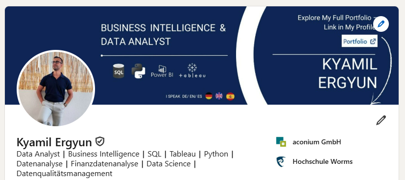

# WELCOME TO MY DATA ANALYSIS PORTFOLIO:

*My name is Kyamil and I am a Berlin (Germany) based Business Intelligence and Data Analyst.
Already having worked for 4 years with data, I have gathered the necessary technical and soft skills
in order to implement robust data strategy to always push for **data-driven decision making**!*

### CHECK MY LINKEDIN, PERSONAL WEBSITE & TABLEAU PROFILE:

#### >> LinkedIn Profile: https://www.linkedin.com/in/kyamil-ergyun/
#### >> Tableau Collection: https://public.tableau.com/app/profile/avantvis/favorites
#### >> Personal Website: https://databiexpert.my.canva.site/

# SKILLS:

### TECHNICKAL SKILLS:

- PostgreSQL / MySQL and Datawarehousing (dimensional modelling).
- Python (Pandas) and partly Airflow.
- Advanced Excel.
- Data vizualization with:
    - Tableau & Power BI certified.
    - Excel 
- Snowflake.

### SOFT SKILLS

- Stakeholder and expectation management.
- Agile (Scrum) Business Intelligence and Data Products development.
- Communication skills: closing the gap between tech and non-tech.
- I speak professional level German, English and Spanish.

# MORE ABOUT ME:

- I am passionate about Business Intelligence, Datawarehousing and Data Analysis:
    - Big Data (**SQL, Python**).
    - Data Warehousing, Data Modelling and ELT.
    - the Data Analysis process.
    - and Data Visualizations (**Tableau, Power BI**).

- This has enabled me:
    - to give valuable business insights to different stakeholders.
    - leading many times to:
        - delivering key ad hoc insights to managments.
        - discover accurate data patterns.
        - making data based predictions.
        - spotting unusual data aspects.

- In order to always push for **data-driven decision making**!
